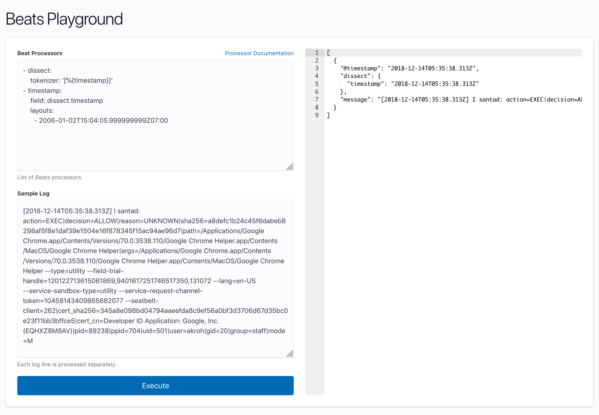

# Beats Playground

Demo: https://andrewkroh.github.io/beats-playground/

It's a web UI to play with Elastic Beats processor configurations.



## How it works

I reused the processors code Elastic Beats and compiled it into a WebAssembly
binary that is loaded by the browser. All processing happens in the browser so
none of your sample/test logs ever leave the browser.

Because of browser limitations, processors that require OS resources
(filesystem, sockets) are not included (e.g. `add_cloud_metadata`,
`add_docker_metdata`, `add_host_metadata`, `add_process_metadata`, `dns`,
`rate_limit`, `translate_sid`).

### Sharing via Share Button

Click the **Share** button to encode the current processor configuration and
sample logs into the URL. The URL is automatically copied to your clipboard
and can be shared with others. Note that the data is stored unencrypted in the
URL.

The state is encoded as a JSON object with the following keys:
- `p` - processors (YAML string)
- `l` - logs (text string)

This JSON is compressed with gzip and then base64 encoded. The URL format is:

`https://andrewkroh.github.io/beats-playground/#s=ENCODED_STATE`

To decode a shared URL, you can use
[CyberChef](https://gchq.github.io/CyberChef/#recipe=URL_Decode\(true\)From_Base64\('A-Za-z0-9%2B/%3D',true,false\)Gunzip\(\))
or the command line:

```bash
pbpaste | base64 -D | gunzip
```

### Loading from External URLs

Alternatively, you can load configurations and sample logs from external URLs
by setting query parameters in the URL fragment (aka hash). It reads
`load_processors` and `load_logs` then loads the content from those URLs. The
format is:

`http://localhost:8084/#?load_processors=PROCESSORS_URL&load_logs=LOGS_URL`

## Self-hosting

Download a release binary and run it yourself. By default the binary listens
for connections at http://localhost:8084/.

## Building

Run `make` and it will produce the `beats-playground` self-contained binary.
Building has several requirements like Go and `yarn`.

## Releasing

Pushes to master automatically update the demo page host by Github Pages. The
commit ID can be verified by looking at the browser's console.

Git tags automatically trigger uploads of binaries to the Github release page.
